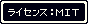

# DQ風のステッカーが作れます

&nbsp;

## 使い方

スタイルシートもほとんどあたっていない、アレな画面ですが、[DQ風ステッカー作成](https://yoshi389111.github.io/dq-microbar)のページへどうぞ。

使用方法や注意事項もそちらに記載してあります。

## ライセンス / Lincese

MIT Lincese

(C) 2025 SATO, Yoshiyuki

## その他のドキュメント

- [yoshi389111/dq1pswd](https://github.com/yoshi389111/dq1pswd) - ふっかつのじゅもんを作れます。１の方です。
- [yoshi389111/dq2pswd](https://github.com/yoshi389111/dq2pswd) - ふっかつのじゅもんを作れます。２の方です。
